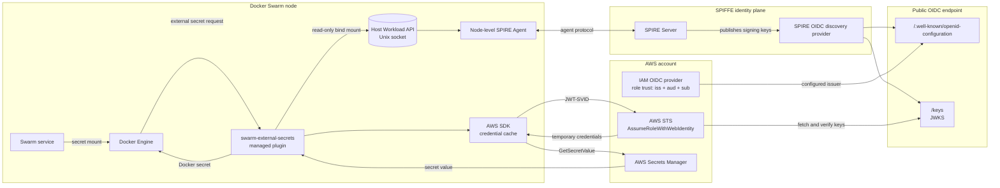
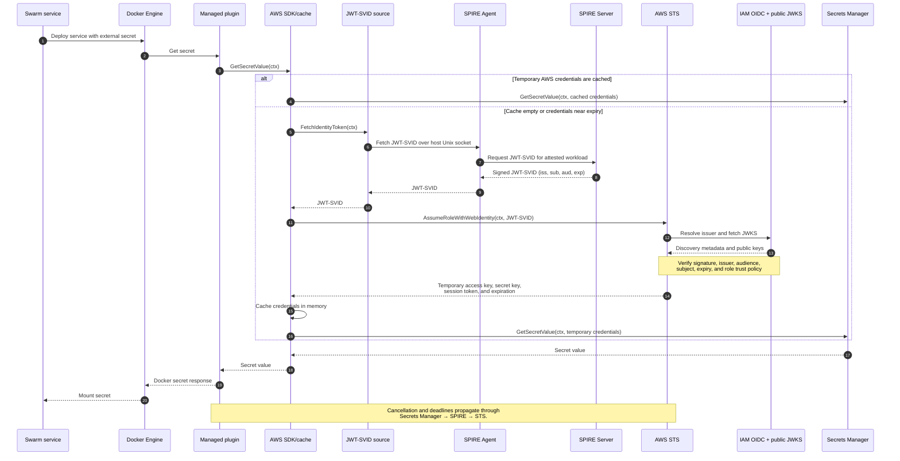

# AWS Secrets Manager with SPIFFE/OIDC

The AWS provider can exchange a SPIRE-issued JWT-SVID for temporary AWS
credentials. No AWS access key is stored in the Docker plugin configuration.

## How it works

1. The plugin asks the node-local SPIRE Agent for a JWT-SVID.
2. The AWS SDK sends that token to `AssumeRoleWithWebIdentity`.
3. AWS validates the token through the configured public OIDC discovery
   endpoint and checks the role's `aud` and `sub` conditions.
4. The SDK caches the temporary credentials and refreshes them when needed.
5. The plugin uses the credentials to call Secrets Manager.

The SPIRE Agent must run once per Swarm node. It is not a service-task sidecar:
Docker managed plugins have a separate lifecycle and runtime namespace.

This implementation does not use `credential_process` or generate an AWS
credentials file. Those are useful for injecting credentials into an
unmodified application. The plugin already owns its AWS SDK client, so it
installs a context-aware credentials provider directly and keeps temporary
credentials in the SDK's in-memory cache.

## High-level architecture



The public OIDC endpoint may be served directly by SPIRE's discovery provider
or synchronized to highly available storage/CDN infrastructure. AWS must be
able to fetch the discovery document and current JWKS.

## End-to-end request flow



## Prerequisites

- A SPIRE Server and a node-level SPIRE Agent on every eligible Swarm node.
- The SPIRE Agent Workload API exposed through a Unix socket.
- A public HTTPS SPIRE OIDC discovery provider with a valid certificate.
- SPIRE Server configured so JWT-SVIDs use that HTTPS URL as their issuer.
- An AWS IAM OIDC provider and IAM role.
- Synchronized clocks on SPIRE Server, Swarm nodes, and the systems serving
  OIDC discovery.

AWS must be able to fetch both:

```text
https://oidc.example.org/.well-known/openid-configuration
https://oidc.example.org/keys
```

Follow the
[SPIRE AWS OIDC federation guide](https://spiffe.io/docs/latest/keyless/oidc-federation-aws/)
when deploying the discovery provider.

## Workload attestation

Docker managed plugins run under dockerd's plugin supervisor and do not appear
as ordinary containers in `docker ps`. Use SPIRE's Unix workload attestor, not
the Docker workload attestor.

For production, register the plugin with a binary hash selector:

```bash
spire-server entry create \
  -parentID spiffe://example.org/spire/agent/<node-id> \
  -spiffeID spiffe://example.org/swarm-external-secrets \
  -selector unix:sha256:<sha256-of-plugin-binary>
```

Update this registration entry whenever the plugin binary changes. Automating
the hash update in the release pipeline is recommended. A path selector may be
added after verifying how `/proc/<pid>/exe` resolves across the plugin mount
namespace on every supported host.

Do not use `unix:uid:0` by itself in production. It allows any matching root
process on the node to request the same identity. The local smoke test uses it
only inside a disposable environment.

## Configure AWS

Create an IAM OIDC provider with:

- Provider URL: `https://oidc.example.org`
- Audience: the target AWS account ID, or the role ARN for stricter
  single-role tokens

Use both the audience and SPIFFE ID in the role trust policy:

```json
{
  "Version": "2012-10-17",
  "Statement": [
    {
      "Effect": "Allow",
      "Principal": {
        "Federated": "arn:aws:iam::123456789012:oidc-provider/oidc.example.org"
      },
      "Action": "sts:AssumeRoleWithWebIdentity",
      "Condition": {
        "StringEquals": {
          "oidc.example.org:aud": "123456789012",
          "oidc.example.org:sub": "spiffe://example.org/swarm-external-secrets"
        }
      }
    }
  ]
}
```

Attach only the Secrets Manager permissions the plugin needs:

```json
{
  "Version": "2012-10-17",
  "Statement": [
    {
      "Effect": "Allow",
      "Action": "secretsmanager:GetSecretValue",
      "Resource": "arn:aws:secretsmanager:us-east-1:123456789012:secret:production/*"
    }
  ]
}
```

If the secrets use a customer-managed KMS key, also grant the minimum required
`kms:Decrypt` permission for that key.

## Mount the Workload API socket

The plugin manifest contains a read-only, settable mount named
`spire-agent-socket`. Its compatibility default mounts host `/run` at
`/run/host`, so existing non-SPIFFE installations do not require a SPIRE
directory. With the standard host socket, the default plugin endpoint is:

```text
unix:///run/host/spire/agent-sockets/api.sock
```

For least exposure, repoint the mount to the exact socket directory before
enabling the plugin. The mount destination remains `/run/host`:

```bash
docker plugin disable swarm-external-secrets:latest --force
docker plugin set swarm-external-secrets:latest \
  spire-agent-socket.source=/run/spire/agent-sockets
```

After narrowing the source, configure the endpoint as:

```text
unix:///run/host/api.sock
```

The source path must exist on every Docker daemon host. It is a host path, not
a path inside a Swarm service container. Ensure the plugin process can traverse
the directory and connect to the socket.

## Configure the plugin

```bash
docker plugin set swarm-external-secrets:latest \
  SECRETS_PROVIDER=aws \
  AWS_REGION=us-east-1 \
  AWS_AUTH_METHOD=spiffe \
  AWS_ROLE_ARN=arn:aws:iam::123456789012:role/swarm-external-secrets \
  AWS_JWT_AUDIENCE=123456789012 \
  SPIFFE_ENDPOINT_SOCKET=unix:///run/host/api.sock

docker plugin enable swarm-external-secrets:latest
```

Do not set `AWS_ACCESS_KEY_ID`, `AWS_SECRET_ACCESS_KEY`, or `AWS_PROFILE` in
SPIFFE mode. The plugin rejects mixed authentication modes.

### Settings

| Variable | Required | Default |
|---|---|---|
| `AWS_AUTH_METHOD` | Yes for this mode | Empty (AWS SDK default chain) |
| `AWS_ROLE_ARN` | Yes | — |
| `AWS_JWT_AUDIENCE` | No | `swarm-external-secrets` |
| `SPIFFE_ENDPOINT_SOCKET` | No | `unix:///run/host/spire/agent-sockets/api.sock` |
| `AWS_REGION` | No | `us-east-1` |
| `AWS_STS_ENDPOINT_URL` | No | AWS STS |
| `AWS_ENDPOINT_URL` | No | AWS Secrets Manager |

The endpoint overrides are intended for tests and compatible AWS emulators.

## Availability and credential refresh

Initialization is lazy: the plugin can start while the SPIRE Agent is
temporarily unavailable. The first AWS request returns an error if the Workload
API cannot be reached, and a later request retries. Each token fetch has a
30-second timeout.

JWT-SVIDs are fetched only for STS exchanges. The AWS SDK caches the resulting
temporary credentials and refreshes them near expiry, so the secret rotation
loop does not call SPIRE or STS on every check.

## Verification

The local test runs a SPIRE Server, node-level SPIRE Agent, Kumo's STS and
Secrets Manager emulators, the managed plugin, and a Swarm service:

```bash
makim scripts.smoke-test-awssm-spiffe
```

Kumo validates the AWS SDK request flow but does not prove JWT signature
validation or the real IAM trust policy.

After provisioning the real issuer, role, SPIRE Agent, and test secret, run:

```bash
AWS_REGION=us-east-1 \
AWS_ROLE_ARN=arn:aws:iam::123456789012:role/swarm-external-secrets \
AWS_SECRET_ID=production/smoke-test \
AWS_SECRET_FIELD=password \
AWS_OIDC_ISSUER_URL=https://oidc.example.org \
SPIFFE_SOCKET_SOURCE=/run/spire/agent-sockets \
AWS_JWT_AUDIENCE=123456789012 \
makim scripts.smoke-test-awssm-spiffe
```

The single entry point selects Kumo when no real-AWS identity variables are
set. If any real-AWS identity variable is present, it validates the complete
configuration before running. Set `AWS_SPIFFE_SMOKE_MODE=local` or
`AWS_SPIFFE_SMOKE_MODE=aws` to override automatic detection. Neither mode
prints the mounted secret.

## Security limitations

- JWT-SVIDs are bearer tokens. Use one audience per cluster or environment,
  keep SVID lifetimes short, and never reuse that audience for unrelated
  workloads.
- SPIFFE authenticates the workload; IAM policies authorize AWS operations.
- Anyone with Docker daemon access already has host-level control. Restrict
  access to Docker and to the SPIRE Agent socket.
- Do not log JWT-SVIDs, STS responses, AWS credentials, or secret values.
- Air-gapped deployments cannot use AWS OIDC federation because AWS must reach
  the discovery endpoint. Consider IAM Roles Anywhere with X.509-SVIDs instead.
- On EC2-only Swarms where node-scoped identity is sufficient, an instance
  profile is simpler and already works through the AWS SDK default chain.

## Troubleshooting

### `failed to connect to SPIFFE Workload API`

- Confirm the host socket exists.
- Check the configured mount source and the path as seen inside the plugin.
- Check directory and socket permissions.
- Confirm the SPIRE Agent is healthy on the node where dockerd runs.

### `failed to fetch JWT-SVID`

- Confirm the registration entry matches the plugin's Unix selectors.
- Recalculate `unix:sha256` after every plugin update.
- Confirm the requested audience is allowed and clocks are synchronized.

### `AccessDenied` from STS

- Compare the JWT `iss`, `aud`, and `sub` with the OIDC provider and role trust
  policy.
- Confirm the discovery document and JWKS are publicly reachable over HTTPS.
- Allow time for IAM changes to propagate.

### Secrets Manager denies access

- The STS exchange succeeded; inspect the assumed role's permission policy,
  secret ARN pattern, region, and KMS permissions.
